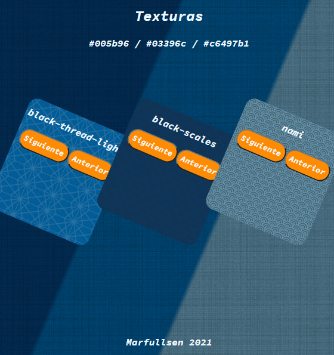

# Texturas usando CSS
[](https://marfullsen.github.io/patrones-css/)
[](https://www.javascript.com/)

[](https://Marfullsen.github.io/patrones-css/)

## Descripción
Mostrario web sobre diferentes tipos de texturas que se pueden aplicar sobre colores y fondos directamente desde css, únicamente usando imágenes de patrones con transparencia disponibles en este [link](https://www.transparenttextures.com/).

## ¿Cómo funciona?
El objeto en cuestión lleva un color de fondo determinado, a este fondo se le aplica una imagen de algún patrón determinado, el cual tiene cierto grado de transparencia, la imagen del patrón se repite las veces que sea necesaria para aplicar el efecto en deseado.

## ¿Cómo uso la página de manera local en mi equipo?
1. Descargar Zip o usar el comando `git clone`.
``` 
git clone https://github.com/Marfullsen/patrones-css.git
``` 
2. Entrar a la carpeta en cuestión.
``` 
cd patrones-css
```
3. Abrir el archivo Index.html con un navegador como Google Chrome, Firefox, Safari, Opera, Brave, etc.
*En caso de algún error, se recomienda usar LiveServer (extensión de VS Code).

## Recomendaciones
En caso de usar imágenes, recomiendo usar paletas de colores similares, yo uso [imageColorPicker](https://imagecolorpicker.com/) para identificar los colores más apropiados.
Siempre es bueno utilizar paletas al momento de diseñar páginas web, recomiendo [colorhunt](https://colorhunt.co/)
Para un mejor acabado recomiendo usar gradientes, una página muy util es [cssgradient](https://cssgradient.io/)

## ¡Visita la página!:
[Marfullsen.github.io/patrones-css/](https://Marfullsen.github.io/patrones-css/)

## Credito
Gracias al sitio web [transparenttextures.com](https://www.transparenttextures.com/) por las increíbles texturas.